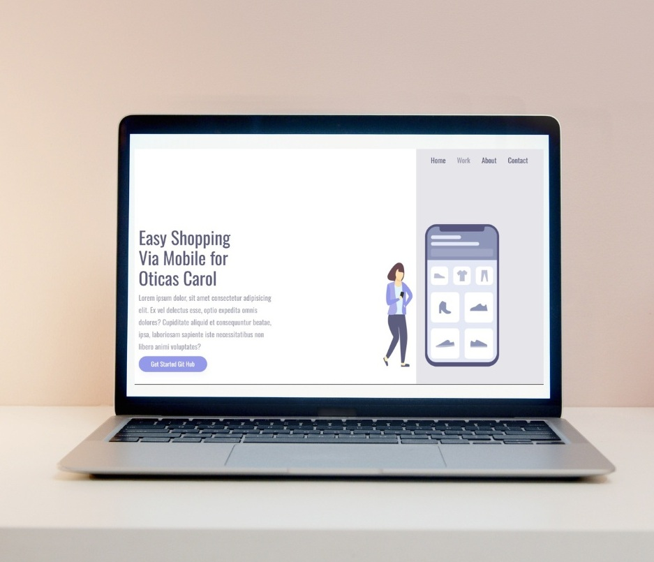
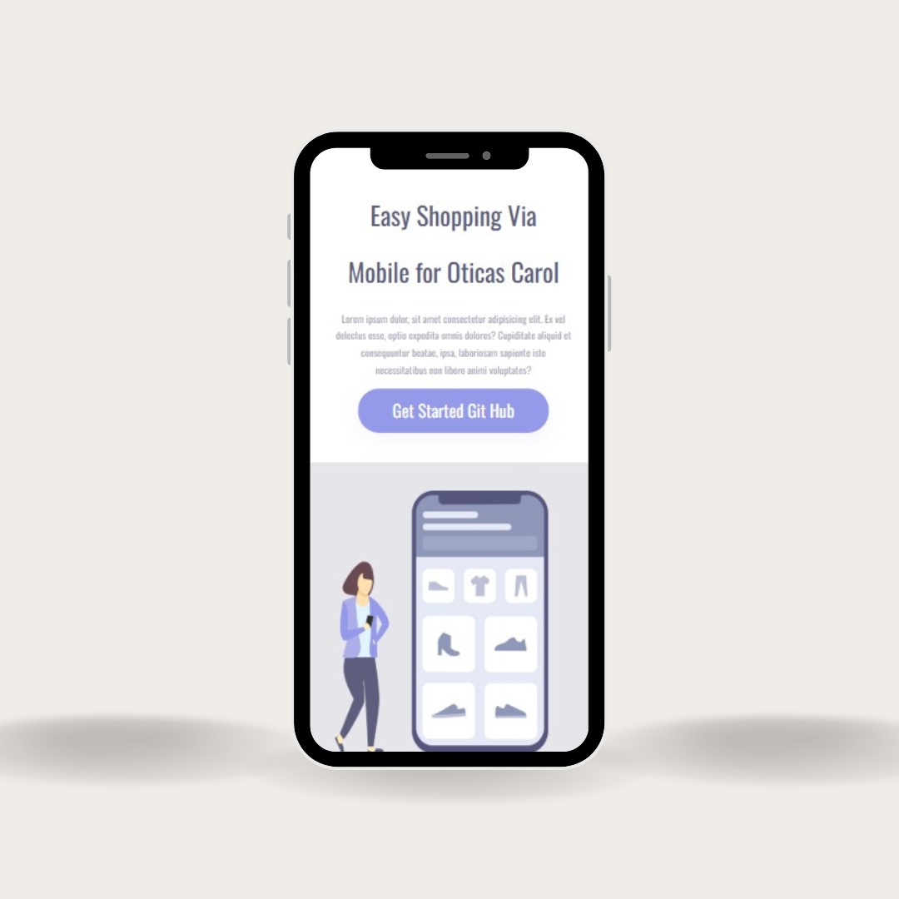

<h1 align="center">Meu Primeiro Projeto Responsivo 👨‍💻</h1>

  Aqui simulei uma página inicial de uma loja, com header para página inicial, seção de como a empresa trabalha, informações sobre a empresa e contatos, tudo com links.

<h2>⚒ Tecnologias usadas no estudo</h2>

  
  

<h2 align="center">Visualização do Projeto</h2>

  <table>
    <tr>
      <td align="center">
        <h3>🖥 Desktop</h3>
        
      </td>
      <td align="center">
        <h3>📱 Smartphone</h3>
        
      </td>
    </tr>
  </table>

<h2>🔗 Links e Navegação</h2>

  - Header para página inicial 
  - Como a empresa trabalha 
  - Saiba mais sobre a empresa 
  - Contatos

  <i>Projeto desenvolvido como estudo de layout responsivo com HTML e CSS.</i>

